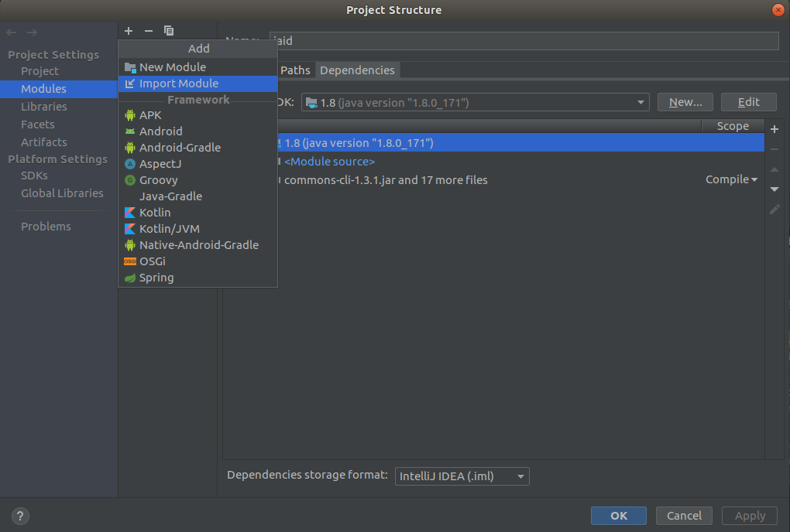
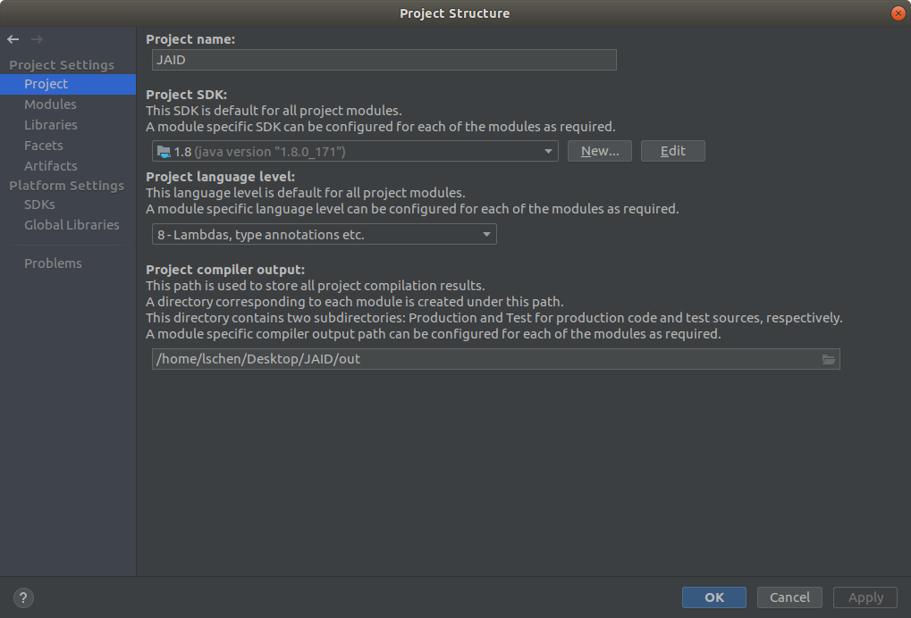
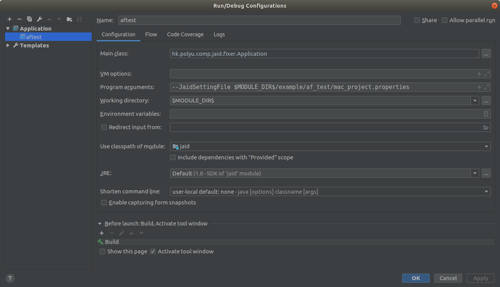

# PatchID
This is the implementation of PatchID.

### Configuring PatchID project in IntelliJ IDEA

1. Clone PatchID project from .

2. Open PatchID project in your IntelliJ IDEA IDE. Go to \[File\]/\[Open\], then browse to yourPath and select `jaid.iml` and click on OK. Or import the provided module file `jaid.iml` in \[Modules\] of project structure after open the project.

    

3. The PatchID project assume a JDK of version 1.8. You need to set up the SDK, language level, compiler output at \[File\]/\[Project Structures\]/\[Project Settings\]/\[Project\].

    

4. Before executing PatchID, you may need to prepare a buggy program and patch for PatchID
    * The input of PatchID includes a buggy program with a test suit contains at least one failing test to reveal the bug, and the method where the bug reside in and patch. The above information alone with other configurations should be specified in a properties file (please refer to Command Line Arguments for details of each argument) and config as a running argument of PatchID as the following image. (The most important configuration is specifying the properties file in the program argument `--JaidSettingFile`.)

    

    * Note: The PatchID project comes with a simple example project for demonstration in folder $JAID_DIR$/example. Please refer to the [Example](example/af_test/README.md).


## Parameters that need to be modified in the code

1. hk.polyu.comp.jaid.monitor.snapshot.snapshotFive:

   ```java
   public String evosuiteJar = "input your path\\evosuite.jar";
   public String jarPath = "input your path\\evosuite-standalone-runtime.jar";
   ```

2. hk.polyu.comp.jaid.java.ProjectCompiler:

   ```java
   public DiagnosticCollector<JavaFileObject> compilePatch(){
   
   File file = new File("input your path\\example\\af_test\\src\\patch\\java\\af_test\\MyList.java");
           
   }
   ```

   

